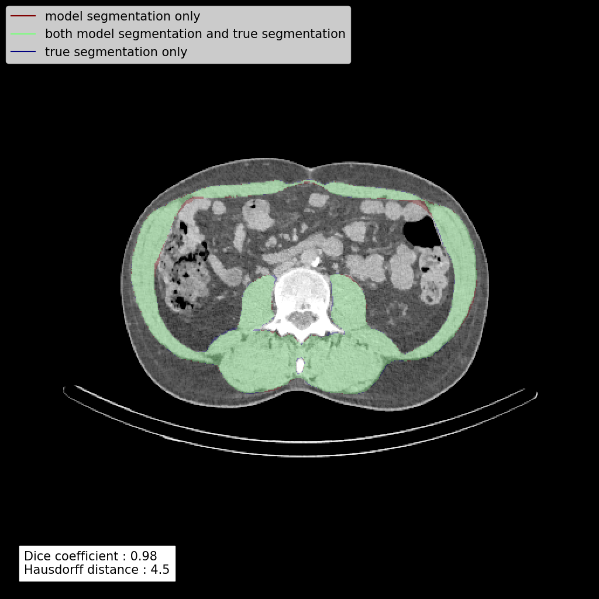

# Image segmentation using deep learning

The goal of this project is to create a machine learning model for automatic image segmentation. This repo provides code for training deep learning segmentation models using Python and Tensorflow and for evaluating their performance.

The motivation for this project was to solve a medical imaging segmentation problem (segmentation of muscular and non-muscular area on L3 CT scan slices). You can find more information about this specific problem and how this project is used to solve it [here](muscle_segmentation_L3.md).

However, the code in this repo could be used to train deep learning models for any other segmentation problem. Below you will find generic information about how to use the code in this repo for training and using a deep learning segmentation model.

## What does this repo provide

This project contains python code for realizing the following steps :
- Prepare a dataset by splitting it in a train set and a test set, and save it in a format appropriate for model training
- Explore different model architectures and hyperparameters and evaluate their performance on the training set
- Train the final model on the training set
- Compute predictions of the final model on the test set and evaluate its performance by comparing the predicted masks and the true masks
- Compute predictions on new data
## Environment setup
### Packages installation
Create a conda environment and install the needed libraries with :
```
conda create -n segmenter
conda activate segmenter
conda install -c conda-forge cudatoolkit=11.2 cudnn=8.1.0 python=3.10 scikit-learn=1.1.1 scikit-image=0.19.3 matplotlib=3.5.2 pandas=1.4.3 seaborn=0.11.2
pip install tensorflow==2.9.1 tensorflow-addons==0.17.1 keras-tuner==1.1.3
```
The versions in the above commands are the one that are currently used to develop this project. Although future versions will probably work without problem, use these versions if you want to be sure to avoid any compatibility issue.
### Config file
After cloning this repo, create a local copy of the file `config_template.py` named `config.py` at the root of the project tree. You can edit its content to fit your needs.

### Pythonpath
To run this project, both the root of the project and `<project root>/src` must be in the pythonpath. If you open this project with PyCharm, this is done automatically.

## How to use this project
The `src/main.py` file contains a line of code for each step of the workflow. To run a step, uncomment the corresponding line in `src/main.py` and run this file.

Each step will save its result on the disk such that the subsequent steps can use it, and so you can run each step separately.

Here is an overview of the various steps. There is more complete information in the code documentation.

If you want to solve the same segmentation problem than we did (muscular area segmentation on L3 CT scan) and just need to train a new model on your data, you can skip step 2 and just use the already chosen hyperparameters. 
### Step 1 : Create the preloaded dataset
The dataset contains images and masks. An image is a 2D array with a resolution of 512 x 512. The corresponding mask is a 2D array with the same dimensions, where each element is either a 1 or a 0.

The original dataset must be provided in `<project root>/original dataset` in CSV files. The exact expected format is described in the documentation of the `data.original_dataset` module.

This step converts your original dataset into a "preloaded" dataset, i.e. a dataset that is stored on the disk in a format appropriate for model training. The preloaded dataset is split into a training set and a test set.

### Step 2 : Explore the model architecture and hyper parameters
During this step, several models with different hyperparameter values are trained and evaluated using data from the training set.

The model architectures, the hyperparameters and their value ranges are defined in the `model_training` module.

The performance of the different models can be visualized using [TensorBoard](https://www.tensorflow.org/tensorboard).

### Step 3 : Train the final model
After having manually chosen the best model architecture and hyperparameters values for your problem, the final model is trained on the whole training set. The model is saved on disk.

### Steps 4 and 5 : Compute the predictions on the test set and evaluate the final performance
The project provides code for comparing the predicted masks with the true masks by computing dice coefficients and Hausdorff distances.

It generates images to visualize the quality of the predictions. Here is an example of such an image :
