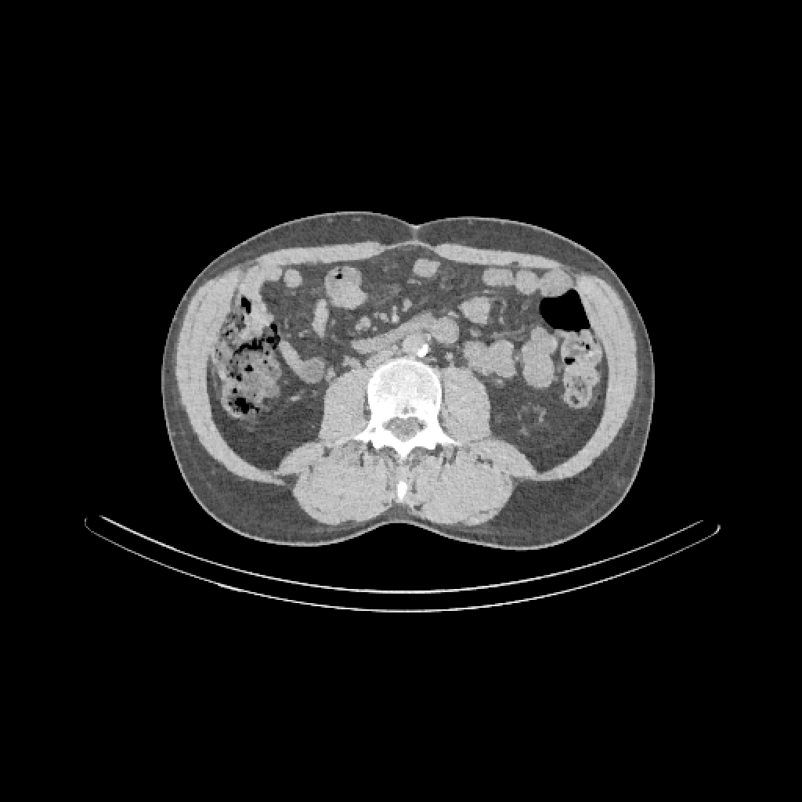
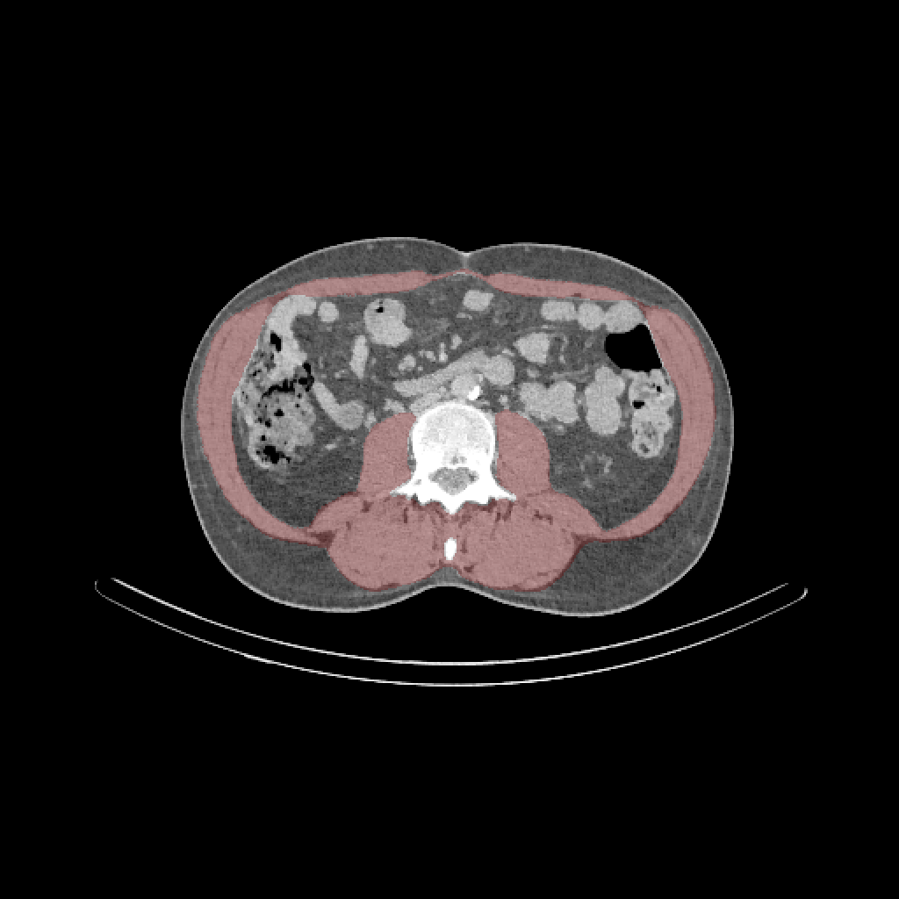
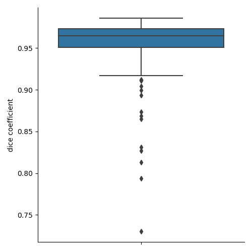
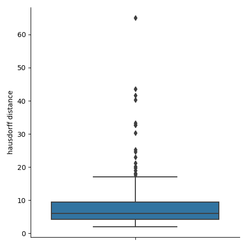
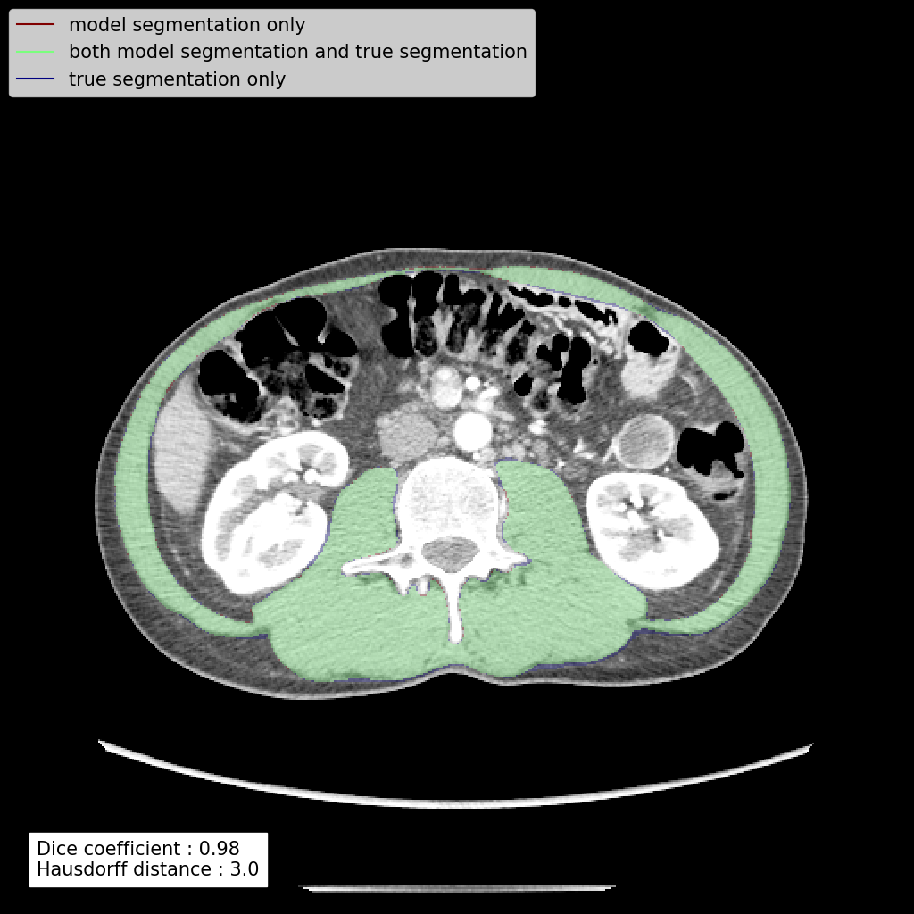
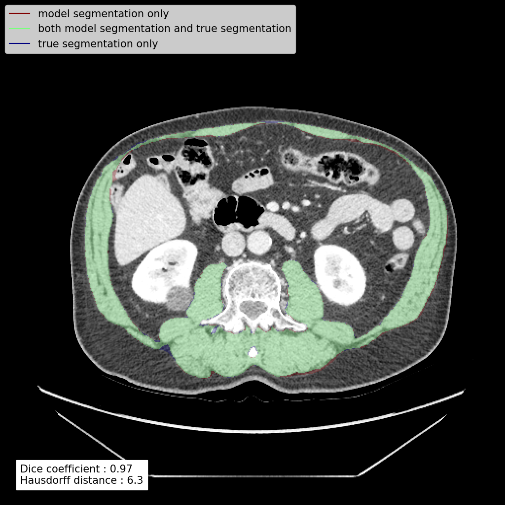
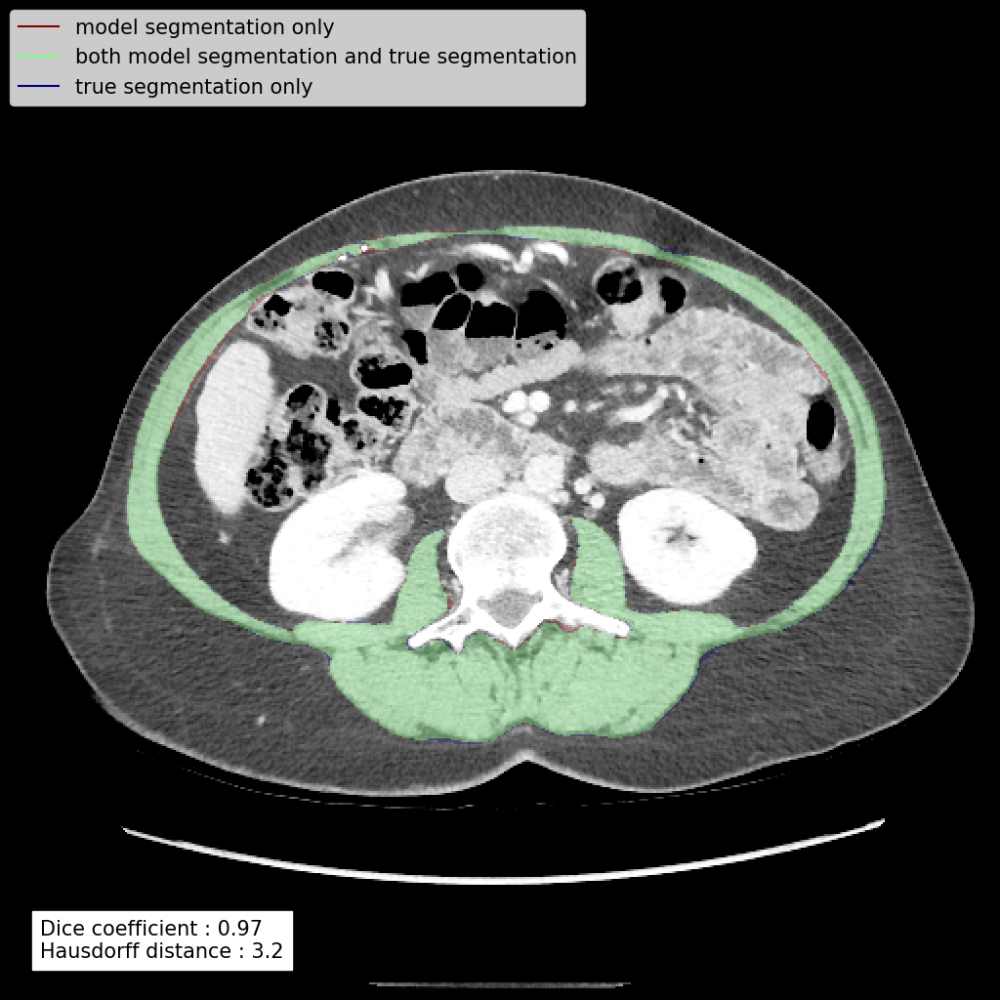

# Automatic segmentation of muscular and non-muscular areas on L3 CT scan slices using deep learning

## The problem to solve

The goal is to segment computed tomographic (CT) scan slices at third lumbar vertebra (L3) into muscular and non-muscular areas. A CT scan slice is a 2D array of values in Hounsfield unit (HU).

Here is an example of such slice where the HU values have been converted to grayscale :

Here is the same image with the muscular area highlighted in red :

The model is given as input an L3 CT scan slice. The model must generate the mask corresponding to the muscular area, i.e. an array with the same dimensions as the input image where each element contains either a 1 if the corresponding pixel image is part of the muscle area, or a 0 otherwise.

## Dataset
The dataset contained 1'055 images wit a corresponding correct mask. It was split in a training set (80% of the data) and a test set (20% of the data).

## Model architecture and hyperparameter exploration
### Methodology
Several hyperparameters were explored. The exploration was performed by repetitively selecting a random set of hyperparameter values and train a model with it. Only the data from the training set was used (split in a sub training set and a validation set).
#### Model architecture
Two architectures were tested :
- Unet
- DeepLabV3+ with ResNet50 pretrained on the ImageNet problem as encoder (transfer learning).
#### Loss function
Binary crossentropy was used as loss function. Both a weighted and a non-weighted version were tested.
#### Optimizer
We tested the Adam optimizer with several learning rates
#### Image data clipping
Both of the followint preprocessing options were tested :
- No preprocessing, give the original HU values of the image to the model
- Clipping between -200 and 200 HU, i.e. pixel values < -200 are set to -200 and pixel values > 200 are set to 200.
#### Data augmentation
The following kind of data augmentation were tested :
- Randomly perform left-right flips
- Apply random rotations
- Apply random gaussian noise
### Result
The best performance was achieved with :
- DeepLabV3+ architecture
- Non-weighted binary crossentropy as loss function
- Adam optimizer wit a learning rate of 0.0002
- Image data clipping between -200 and 200 HU
- No data augmentation
## Final model
The final model was trained on the whole training set with the above described hyperparameters during 100 epochs.

The performance was evaluated on the 263 images of the test set by comparing the masks predicted by the model with the correct ones.

The average dice coefficient and Hausdorff distance (in pixels) were respectively 0.96 and 8.2. The distributions were the following :

Here are some randomly chosen images of the test set, where the differences between the predicted masks and the correct masks can be seen :

